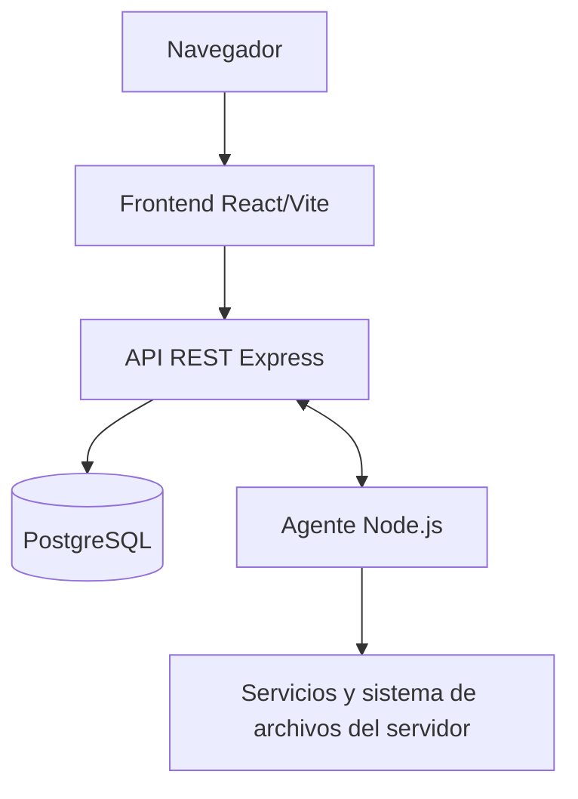

# ServerHub

## Objetivo

Centralizar el registro, monitoreo y administración de servidores mediante una API y un agente instalado en cada servidor.

## Componentes

1. **Frontend**: aplicación React/Vite con rutas para autenticación, dashboard y detalle de servidores.
2. **Backend**: API REST Express que autentica usuarios, coordina agentes y accede a PostgreSQL.
3. **Agente**: proceso Node.js que registra el servidor, envía información y métricas, y ejecuta comandos remotos.
4. **PostgreSQL**: persistencia de usuarios, servidores, agentes, métricas, alertas, sesiones, comandos y auditoría.



No se utiliza WebSocket, SSE ni Socket.IO. El frontend actualiza datos mediante polling HTTP.

## Flujo de registro y monitoreo

1. El usuario crea una cuenta o inicia sesión.
2. El usuario crea un servidor y genera una clave de registro con vencimiento de 24 horas.
3. El agente se inicia con la clave y llama a `POST /api/agent/register`.
4. El backend crea el agente, devuelve un token y un secreto, y marca la clave como usada.
5. El agente firma sus peticiones con HMAC-SHA256 y envía heartbeat, métricas e información del sistema.
6. El backend guarda las métricas, calcula estados y crea o resuelve alertas.

El heartbeat y las métricas se envían cada 10 segundos. El backend marca un agente como offline después de 2 minutos sin heartbeat. Una tarea revisa agentes offline cada 5 minutos y otra elimina métricas de más de 90 días diariamente a las 03:00.

## Seguridad y autorización

- Las rutas de usuario usan JWT en `Authorization: Bearer <token>`.
- El JWT de usuario dura 24 horas.
- Las peticiones del agente usan `X-Agent-Token`, `X-Agent-Signature`, `timestamp` y `nonce`.
- La firma se valida con HMAC-SHA256 y comparación segura; el timestamp admite una ventana de 30 segundos.
- Los nonces se conservan en memoria durante 30 segundos para evitar reutilización.
- El agente aplica límites de frecuencia: heartbeat y métricas cada 5 segundos como mínimo, información del sistema cada 60 segundos y renovación cada hora.
- Las operaciones remotas requieren JWT y una sesión administrativa del servidor. La sesión dura 15 minutos y se envía en `X-Admin-Session`.

## Datos persistidos

El código consulta o escribe estas tablas:

- `users`: usuarios y contraseñas hash.
- `servers`: servidores, propietario, descripción, estado y contraseña administrativa hash.
- `registration_keys`: claves, servidor asociado, uso y vencimiento.
- `agents`: token, secreto, vencimiento, versión, hostname, sistema operativo, arquitectura y último heartbeat.
- `server_metrics`: métricas de CPU, RAM y disco.
- `alerts`: alertas por servidor, tipo, mensaje y resolución.
- `admin_sessions`: sesiones administrativas temporales.
- `agent_commands`: comandos pendientes y sus resultados.
- `audit_logs`: eventos y detalles en JSON.

No hay migraciones ni definición SQL en el repositorio. `refresh_tokens` no es utilizada por el código actual.

## Comandos remotos

El backend encola comandos en `agent_commands`; el agente los consulta, ejecuta y completa. Están implementados `PING`, `LIST_PROCESSES`, `LIST_SERVICES`, `START_SERVICE`, `STOP_SERVICE`, `RESTART_SERVICE`, `FILE_BROWSER`, `DOWNLOAD_FILE`, `UPLOAD_FILE`, `CREATE_FOLDER`, `RENAME_FILE`, `DELETE_FILE` y `MOVE_FILE`.

Las operaciones de servicio y archivos se exponen bajo `/api/server/:id`. El agente realiza la operación localmente, con soporte para Windows y Unix según el servicio invocado.

## Tareas y sincronización

- Agente: heartbeat cada 10 segundos, métricas cada 10 segundos, polling de comandos cada 10 segundos y comprobación diaria de expiración de token.
- Backend: detección de agentes offline cada 5 minutos y limpieza de métricas a las 03:00.
- Frontend: dashboard cada 20 segundos y estado/última métrica del detalle cada 15 segundos.

## Estructura

```text
ServerHub/
├── backend/
│   └── src/         # API, rutas, controladores, servicios, jobs y validadores
├── frontend/
│   └── src/         # páginas, componentes, servicios y estilos React
├── serverhub-agent/
│   └── src/         # registro, métricas, comandos, credenciales y runtime
├── README.md
├── DOCUMENTACION.md
└── ARCHITECTURE.md
```

El punto de entrada del backend es `backend/src/server.js`, el del frontend `frontend/src/main.jsx` y el del agente `serverhub-agent/src/index.js`.