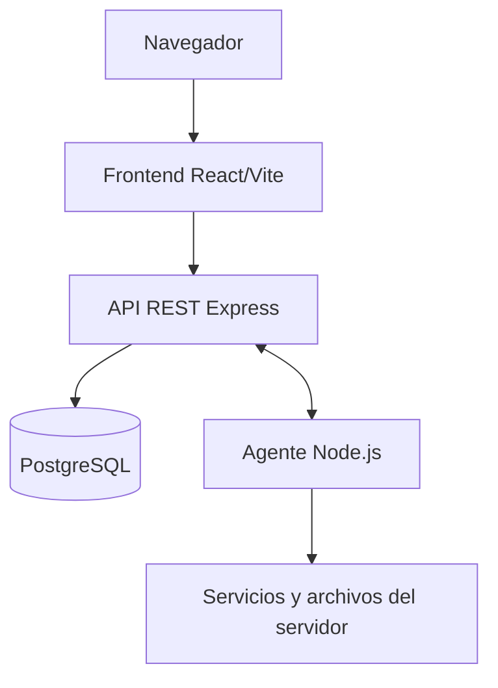

# DOCUMENTACION TECNICA - ServerHub

## 1. Descripcion general

ServerHub es una aplicacion web para registrar, monitorear y administrar servidores mediante un agente Node.js instalado en cada servidor.

El sistema esta compuesto por un frontend React/Vite, una API REST Express, PostgreSQL y el agente ServerHub. El frontend y el agente se comunican con el backend por HTTP. No se implementan WebSocket, SSE ni Socket.IO.

## 2. Funcionalidades actuales

- Registro, login y consulta del perfil de usuarios.
- CRUD de servidores y verificacion de la contrasena administrativa.
- Generacion y listado de claves temporales para registrar agentes.
- Registro de agentes, heartbeat, informacion del sistema, metricas y renovacion de tokens.
- Dashboard agregado, estado de agentes y alertas activas o historicas.
- Sesiones administrativas de 15 minutos.
- Inicio, detencion y reinicio de servicios remotos.
- Exploracion, descarga, subida, creacion de carpetas, renombrado, eliminacion y movimiento de archivos.
- Ejecucion de comandos mediante una cola consultada por el agente.

## 3. Arquitectura y flujo



1. El usuario se registra o inicia sesion.
2. Crea un servidor y genera una clave de registro que vence en 24 horas.
3. El agente se inicia con esa clave y se registra en `POST /api/agent/register`.
4. El backend devuelve un token y un secreto para firmar las peticiones posteriores.
5. El agente envia heartbeat y metricas cada 10 segundos.
6. El frontend consulta el dashboard cada 20 segundos y el detalle de servidor cada 15 segundos.

El backend comprueba la conexion a PostgreSQL antes de iniciar. Ejecuta una tarea de deteccion de agentes offline cada 5 minutos y una limpieza diaria de metricas con mas de 90 dias, programada a las 03:00.

## 4. Tecnologias

| Componente | Tecnologia | Uso |
|---|---|---|
| Backend | Node.js CommonJS, Express 5 | API REST |
| Frontend | React 19, React Router 7, Vite 8 | Interfaz web |
| Base de datos | PostgreSQL, `pg` | Persistencia |
| Agente | Node.js, Axios, systeminformation | Comunicacion y datos del servidor |
| Autenticacion | JSON Web Token, bcrypt | Usuarios y contrasenas |
| Validacion | Joi | Payloads del agente |
| Tareas | node-cron | Jobs del backend |
| Desarrollo frontend | ESLint | Linting |

Las versiones concretas se encuentran en los `package.json` de cada componente.

## 5. Estructura del proyecto

```text
ServerHub/
├── backend/
│   └── src/
│       ├── config/          # PostgreSQL, entorno y configuracion SSH
│       ├── controllers/     # Controladores HTTP
│       ├── jobs/            # Offline y limpieza de metricas
│       ├── middlewares/     # JWT, agente, sesiones y validacion
│       ├── routes/          # Rutas de la API
│       ├── services/        # Logica de negocio y acceso a datos
│       ├── utils/           # Nonces y utilidades
│       └── validators/      # Esquemas Joi
├── frontend/
│   └── src/
│       ├── components/      # Componentes React
│       ├── pages/           # Login, registro, dashboard y servidores
│       ├── services/        # Cliente y servicios de API
│       └── config/          # URL de API
├── serverhub-agent/
│   └── src/
│       ├── config/          # Configuracion del agente
│       ├── services/        # Registro, metricas, comandos y sistema
│       └── utils/           # Firma, nonce, logs y lock
├── ARCHITECTURE.md
├── README.md
└── docker-compose.yml
```

Entradas: `backend/src/server.js`, `frontend/src/main.jsx` y `serverhub-agent/src/index.js`.

## 6. Instalacion y ejecucion

No existe un `package.json` en la raiz. Instala dependencias desde cada componente.

### Backend

```bash
cd backend
npm install
npm run dev
```

`npm start` ejecuta el backend con Node.js sin `nodemon`. El puerto predeterminado es `3000`. El proceso termina si no puede conectarse a PostgreSQL.

### Frontend

```bash
cd frontend
npm install
npm run dev
```

Scripts disponibles: `dev`, `build`, `preview` y `lint`.

### Agente

```bash
cd serverhub-agent
npm install
node src/index.js SHUB-XXXX-XXXX
```

La clave se genera desde `POST /api/registration-keys` y se utiliza una sola vez. El agente soporta Windows y sistemas Unix. Su script `test` es el placeholder del `package.json` y termina con error; backend y frontend no definen scripts de pruebas.

`docker-compose.yml` esta vacio; no configura PostgreSQL, backend ni frontend.

## 7. Configuracion

### Backend: `.env`

| Variable | Uso | Valor por defecto |
|---|---|---|
| `PORT` | Puerto HTTP | `3000` |
| `DB_HOST` | Host PostgreSQL | Sin valor en codigo |
| `DB_PORT` | Puerto PostgreSQL | Sin valor en codigo |
| `DB_NAME` | Base de datos | Sin valor en codigo |
| `DB_USER` | Usuario PostgreSQL | Sin valor en codigo |
| `DB_PASSWORD` | Contrasena PostgreSQL | Sin valor en codigo |
| `JWT_SECRET` | Firma de JWT | Sin valor en codigo |
| `SSH_HOST` | Configuracion SSH disponible | Sin valor en codigo |
| `SSH_PORT` | Configuracion SSH disponible | Sin valor en codigo |
| `SSH_USER` | Configuracion SSH disponible | Sin valor en codigo |
| `SSH_PASSWORD` | Configuracion SSH disponible | Sin valor en codigo |

El codigo carga estas variables con `dotenv`. Las variables SSH existen en la configuracion, pero las operaciones remotas actuales se ejecutan a traves del agente.

### Frontend: `.env.local`

| Variable | Uso | Valor por defecto |
|---|---|---|
| `VITE_API_URL` | URL base del backend | `http://localhost:3000` |

### Agente: `src/config/config.json`

| Campo | Uso | Valor actual |
|---|---|---|
| `apiUrl` | URL del backend | `http://localhost:3000` |
| `agentToken` | Token persistido despues del registro | Vacio inicialmente |
| `agentSecret` | Secreto persistido despues del registro | Vacio inicialmente |
| `heartbeatIntervalMs` | Intervalo de heartbeat | `10000` |
| `statsIntervalMs` | Intervalo de metricas | `10000` |
| `version` | Version reportada | `1.0.0` |

## 8. Datos y reglas de negocio

El codigo consulta o escribe las tablas `users`, `servers`, `registration_keys`, `agents`, `server_metrics`, `alerts`, `admin_sessions`, `agent_commands` y `audit_logs`.

- Un usuario es propietario de sus servidores.
- Una clave de registro vence en 24 horas y se marca como usada al registrar el agente.
- El token del agente dura 90 dias y puede renovarse preventivamente cuando quedan 15 dias o menos.
- CPU, RAM y disco validos estan entre 0 y 100. Se crea alerta cuando el valor es estrictamente mayor que 90 y se resuelve cuando vuelve a 90 o menos.
- Un agente se considera offline cuando su ultimo heartbeat supera 2 minutos o no existe.
- No se duplican alertas activas del mismo tipo para un servidor.
- Las metricas de mas de 90 dias se eliminan en la tarea de limpieza.

No hay migraciones ni scripts SQL en el repositorio. La base de datos debe prepararse externamente con las columnas que las consultas del backend utilizan.

## 9. Autenticacion y sesiones administrativas

### Usuarios

`POST /api/auth/register` crea un usuario con contrasena hash mediante bcrypt. `POST /api/auth/login` devuelve un JWT con una duracion de 24 horas. Las rutas de usuario protegidas esperan `Authorization: Bearer <token>`.

### Agentes

Las peticiones autenticadas del agente incluyen:

- `X-Agent-Token`.
- `X-Agent-Signature`, una firma HMAC-SHA256 del cuerpo.
- `timestamp`, validado en una ventana de 30 segundos.
- `nonce`, retenido en memoria durante 30 segundos para evitar replay.

El backend compara la firma de forma segura y aplica limites de frecuencia por agente.

### Sesion administrativa

El usuario verifica la contrasena administrativa del servidor y crea una sesion de 15 minutos. Las operaciones remotas envian su token en `X-Admin-Session`. El middleware valida usuario, servidor, token y expiracion; el logout elimina la sesion.

## 10. API y endpoints

Todas las rutas tienen el prefijo indicado. Las rutas no marcadas como publicas requieren la autenticacion indicada por su middleware.

### Salud y autenticacion

| Metodo | Ruta | Acceso |
|---|---|---|
| GET | `/api/health` | Publico |
| GET | `/api/server/health` | Publico |
| GET | `/api/server/info` | Publico |
| POST | `/api/auth/register` | Publico |
| POST | `/api/auth/login` | Publico |
| GET | `/api/auth/profile` | JWT |

### Servidores y dashboard

| Metodo | Ruta | Acceso |
|---|---|---|
| POST | `/api/server` | JWT |
| GET | `/api/server` | JWT |
| GET | `/api/server/:id` | JWT |
| PUT | `/api/server/:id` | JWT |
| DELETE | `/api/server/:id` | JWT |
| GET | `/api/server/:id/metrics` | JWT |
| GET | `/api/server/:id/latest` | JWT |
| GET | `/api/server/:id/agent` | JWT |
| POST | `/api/server/:id/verify-password` | JWT |
| GET | `/api/dashboard` | JWT |

### Claves, agentes y alertas

| Metodo | Ruta | Acceso |
|---|---|---|
| POST | `/api/registration-keys` | JWT |
| GET | `/api/registration-keys` | JWT |
| POST | `/api/agent/register` | Publico con clave |
| POST | `/api/agent/heartbeat` | Agente |
| POST | `/api/agent/stats` | Agente |
| POST | `/api/agent/system-info` | Agente |
| POST | `/api/agent/refresh-token` | Agente |
| POST | `/api/agent/token-info` | Agente |
| GET | `/api/alerts` | JWT |
| GET | `/api/alerts/active` | JWT |

### Sesiones, servicios y archivos

| Metodo | Ruta | Acceso |
|---|---|---|
| POST | `/api/server/:id/admin-session` | JWT |
| POST | `/api/server/:id/admin-session/logout` | JWT |
| POST | `/api/server/:id/services/start` | JWT + sesion administrativa |
| POST | `/api/server/:id/services/stop` | JWT + sesion administrativa |
| POST | `/api/server/:id/services/restart` | JWT + sesion administrativa |
| POST | `/api/server/:id/files/browse` | JWT + sesion administrativa |
| POST | `/api/server/:id/files/download` | JWT + sesion administrativa |
| POST | `/api/server/:id/files/upload` | JWT + sesion administrativa |
| POST | `/api/server/:id/files/create-folder` | JWT + sesion administrativa |
| POST | `/api/server/:id/files/rename` | JWT + sesion administrativa |
| POST | `/api/server/:id/files/delete` | JWT + sesion administrativa |
| POST | `/api/server/:id/files/move` | JWT + sesion administrativa |

### Cola de comandos del agente

| Metodo | Ruta | Acceso |
|---|---|---|
| POST | `/api/agent/commands/create` | La ruta no aplica middleware en el codigo actual |
| POST | `/api/agent/commands/pending` | Agente |
| POST | `/api/agent/commands/complete` | Agente |
| GET | `/api/agent/commands/download/:id` | La ruta no aplica middleware en el codigo actual |

Los tipos implementados son `PING`, `LIST_PROCESSES`, `LIST_SERVICES`, `START_SERVICE`, `STOP_SERVICE`, `RESTART_SERVICE`, `FILE_BROWSER`, `DOWNLOAD_FILE`, `UPLOAD_FILE`, `CREATE_FOLDER`, `RENAME_FILE`, `DELETE_FILE` y `MOVE_FILE`.

## 11. Interfaz frontend

- `/login`: inicio de sesion.
- `/register`: registro.
- `/dashboard`: dashboard protegido.
- `/servers/:id`: detalle protegido.
- `/`: redireccion a `/dashboard`.
- Cualquier otra ruta muestra `NotFound`.

El listado de servidores se carga al entrar y despues de eliminar. El dashboard usa polling de 20 segundos. El detalle actualiza agente y ultima metrica cada 15 segundos, sin recargar el historial en cada ciclo.

## 12. Limitaciones conocidas

- No hay migraciones, esquema SQL ni datos iniciales en el repositorio.
- `docker-compose.yml` esta vacio.
- No existe una suite de pruebas configurada.
- El frontend no expone en sus rutas actuales todas las operaciones de archivos, servicios y comandos disponibles en la API.
- La configuracion SSH y algunos servicios auxiliares existen en el backend, pero el flujo remoto implementado se realiza mediante el agente.