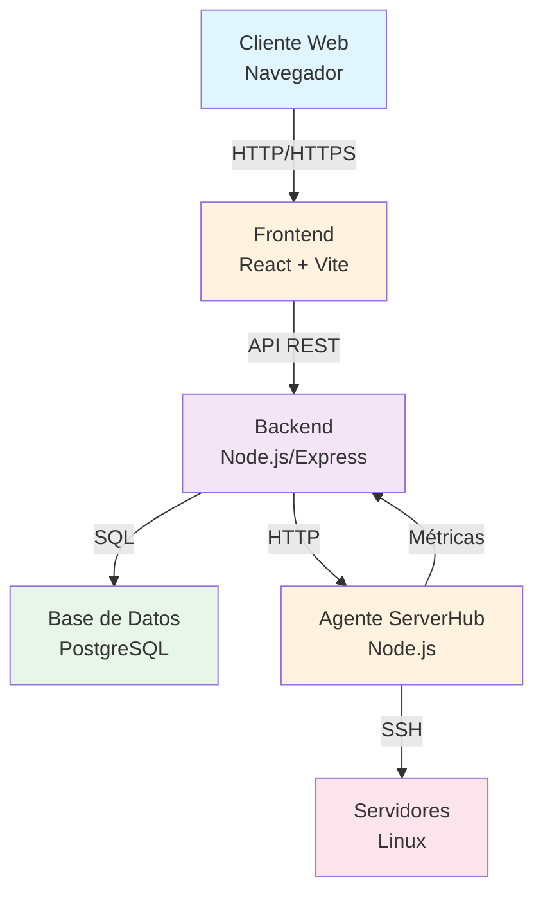
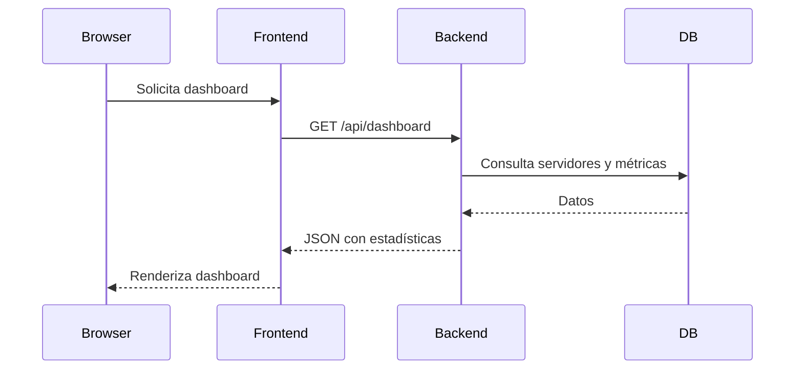
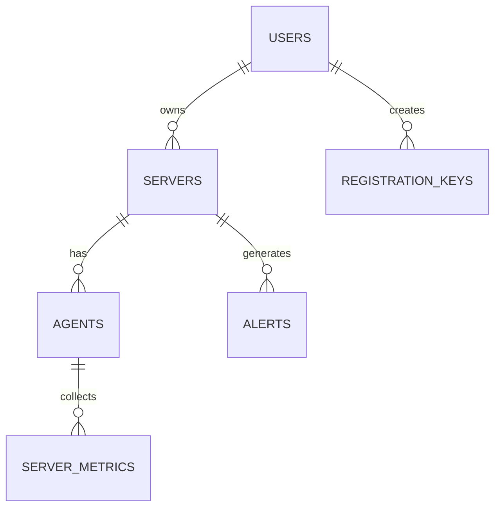
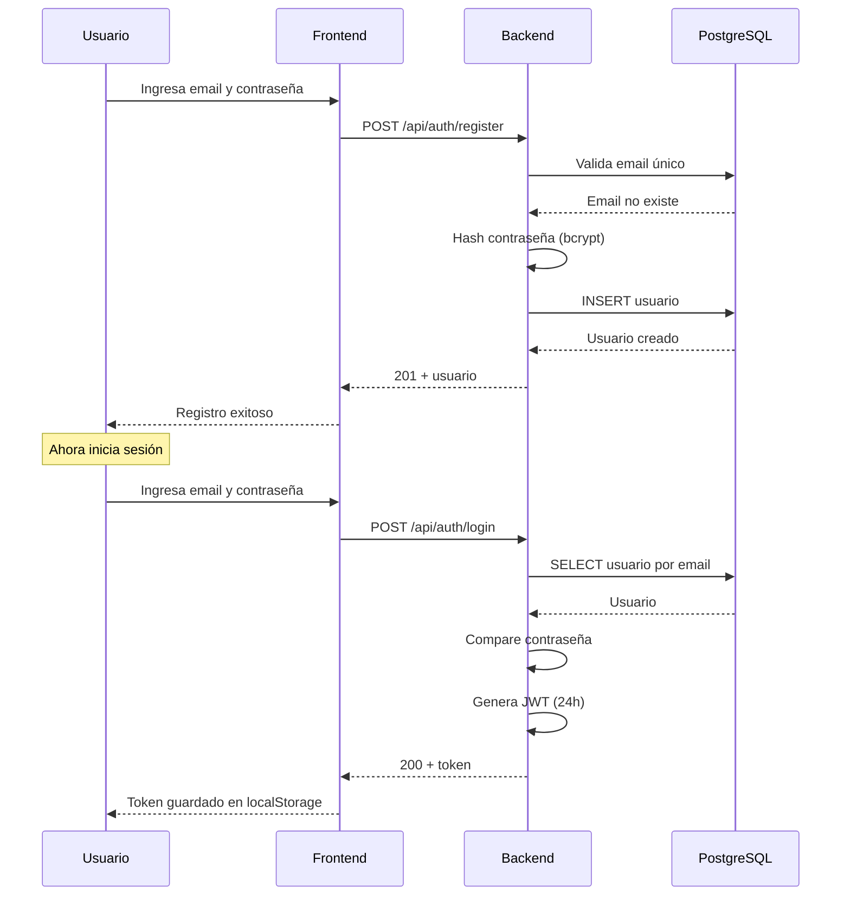
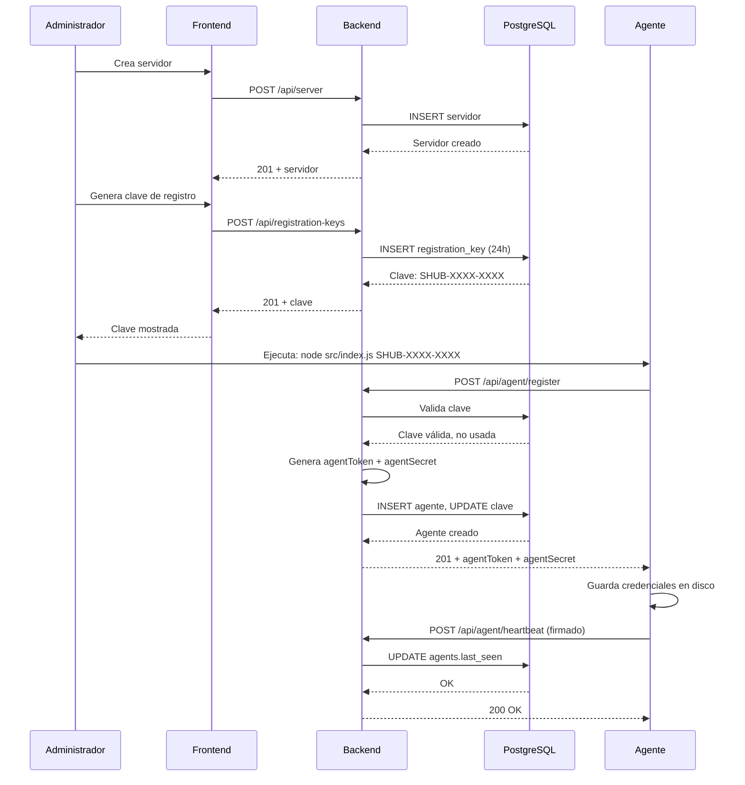
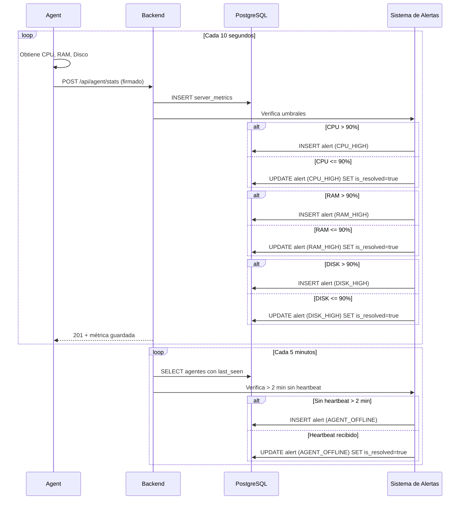
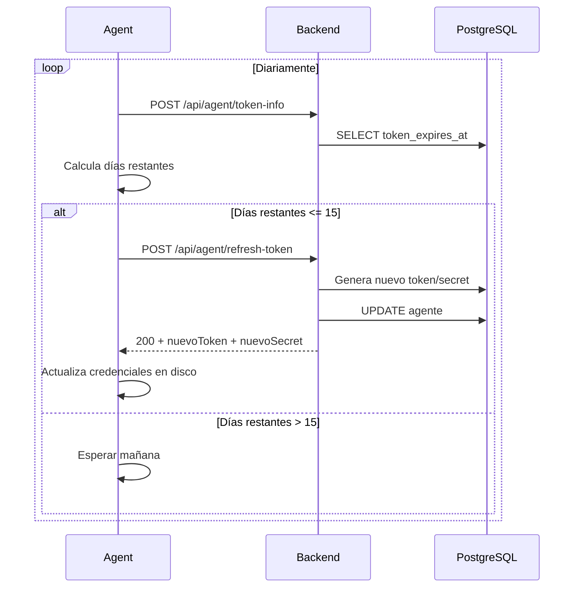
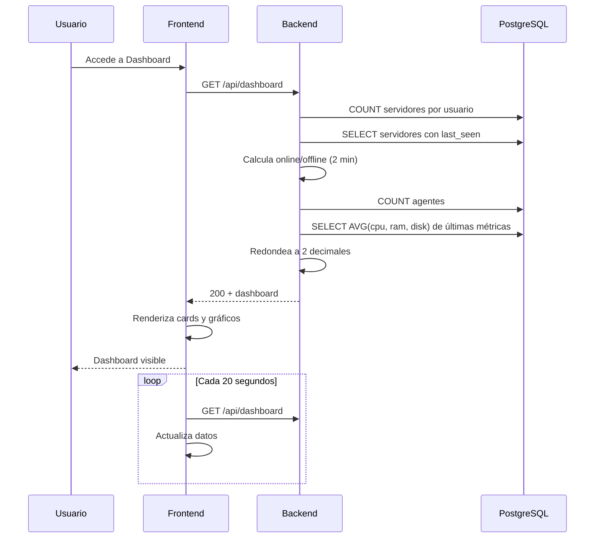

# DOCUMENTACIÓN TÉCNICA - ServerHub

## 1. Descripción General

**ServerHub** es un sistema de administración y monitoreo de servidores Linux diseñado para proporcionar una interfaz centralizada para gestionar múltiples VPS/servidores desde la nube.

### Propósito
- Administrar y monitorear servidores Linux remotos desde una interfaz web intuitiva
- Recolectar y visualizar métricas en tiempo real (CPU, RAM, Disco)
- Generar alertas cuando los recursos excedan umbrales críticos
- Proporcionar un sistema seguro de registro y vinculación de agentes

### Usuarios
- Administradores de sistemas que necesitan gestionar múltiples servidores
- Desarrolladores que requieren monitoreo centralizado de infraestructura

### Funcionalidades Principales (MVP)
- Autenticación de usuarios con JWT
- Registro y gestión de servidores
- Instalación y vinculación de agentes mediante claves de registro temporales
- Monitoreo de recursos en tiempo real (CPU, RAM, Disco)
- Sistema de alertas automáticas basadas en umbrales
- Dashboard con estadísticas agregadas
- Historial de auditoría de operaciones críticas

---

## 2. Arquitectura del Sistema

### Componentes Principales



### Flujo de una Petición Típica



### Autenticación

**Sistema JWT:**
1. Usuario se registra o inicia sesión con email y contraseña
2. Backend valida credenciales contra base de datos (bcrypt)
3. Backend emite token JWT con duración de 24 horas
4. Frontend almacena token en `localStorage`
5. Cada petición autenticada incluye token en header `Authorization: Bearer <token>`
6. Middleware valida y extrae información del usuario del token

**Autenticación de Agente:**
1. Agente se registra con clave temporal que vence en 24 horas
2. Backend genera `agentToken` y `agentSecret` (crypto 32 bytes)
3. Agente almacena credenciales localmente en `/etc/serverhub/credentials.json` (Linux) o `C:\ProgramData\ServerHub\credentials.json` (Windows)
4. Cada petición incluye:
   - Header `X-Agent-Token`
   - Header `X-Agent-Signature` (HMAC-SHA256 del payload)
   - Body incluye `timestamp` y `nonce` único (MD5)
5. Middleware valida firma con `timingSafeEqual` para evitar timing attacks
6. Token expira en 90 días y puede renovarse preventivamente

### Autorización

- **Usuarios**: Solo acceden a sus propios servidores y datos
- **Agentes**: Solo pueden reportar métricas de su servidor asignado
- **Endpoints protegidos**: Requieren JWT válido o autenticación de agente

### Persistencia de Datos

**PostgreSQL:**
- Almacena usuarios, servidores, agentes, métricas, alertas y logs de auditoría
- Relaciones:
  - Usuario → N Servidores
  - Servidor → 1 Agente
  - Agente → N Métricas
  - Servidor → N Alertas
  - Sistema → N Audit Logs
  - Usuario → N Registration Keys

---

## 3. Tecnologías Utilizadas

| Tecnología | Versión | Uso |
|---|---|---|
| **Node.js** | - | Runtime para backend y agente |
| **Express** | 5.2.1 | Framework web backend |
| **React** | 19.2.7 | Framework UI frontend |
| **Vite** | 8.1.1 | Bundler y dev server frontend |
| **PostgreSQL** | - | Base de datos relacional |
| **JWT** | 9.0.3 | Generación y validación de tokens |
| **bcrypt** | 6.0.0 | Hashing de contraseñas |
| **Joi** | 18.2.3 | Validación de esquemas |
| **Axios** | 1.19.0 | Cliente HTTP del agente |
| **ssh2** | 1.17.0 | Conexiones SSH |
| **node-cron** | 4.6.0 | Tareas programadas |
| **systeminformation** | 5.33.1 | Información del sistema (agente) |
| **CORS** | 2.8.6 | Control de origen cruzado |
| **dotenv** | 17.4.2 | Variables de entorno |
| **React Router** | 7.1.1 | Enrutamiento frontend |
| **ESLint** | 10.6.0 | Linting frontend |
| **nodemon** | 3.1.14 | Recarga automática en desarrollo |

---

## 4. Estructura del Proyecto

### Raíz del Proyecto
```
ServerHub/
├── backend/              # API REST principal
├── frontend/             # Interfaz de usuario
├── serverhub-agent/      # Agente para servidores Linux
├── ARCHITECTURE.md       # Diseño de alto nivel
├── README.md            # Descripción breve
├── docker-compose.yml   # Configuración Docker (vacío)
└── DOCUMENTACION.md     # Este archivo
```

### Backend (`backend/`)

```
backend/
├── src/
│   ├── app.js                      # Aplicación Express
│   ├── server.js                   # Punto de entrada
│   ├── config/
│   │   ├── db.js                   # Pool de conexión PostgreSQL
│   │   ├── env.js                  # Variables de entorno
│   │   └── ssh.js                  # Configuración SSH (no utilizada actualmente)
│   ├── routes/
│   │   ├── auth.routes.js          # Autenticación de usuarios
│   │   ├── server.routes.js        # CRUD de servidores y métricas
│   │   ├── agent.routes.js         # Endpoints del agente
│   │   ├── registration-key.routes.js # Claves de registro
│   │   ├── dashboard.routes.js     # Estadísticas agregadas
│   │   ├── health.routes.js        # Health check
│   │   └── alert.routes.js         # Alertas
│   ├── controllers/
│   │   ├── auth.controller.js      # Lógica de autenticación
│   │   ├── server.controller.js    # Operaciones de servidores
│   │   ├── agent.controller.js     # Endpoints del agente
│   │   ├── registration-key.controller.js
│   │   ├── alert.controller.js
│   │   ├── dashboard.controller.js
│   │   ├── health.controller.js
│   │   └── files.controller.js     # (No implementado)
│   ├── services/
│   │   ├── auth.service.js         # Lógica de autenticación
│   │   ├── server.service.js       # Operaciones de servidores
│   │   ├── agent.service.js        # Lógica de agentes
│   │   ├── registration-key.service.js # Generación y validación de claves
│   │   ├── alert.service.js        # Gestión de alertas
│   │   ├── audit.service.js        # Logs de auditoría
│   │   ├── dashboard.service.js    # Cálculo de estadísticas
│   │   ├── metrics-cleanup.service.js # Limpieza de métricas antiguas
│   │   ├── docker.service.js       # (No implementado)
│   │   ├── monitor.service.js      # (No implementado)
│   │   └── ssh.service.js          # (No implementado)
│   ├── middlewares/
│   │   ├── auth.middleware.js      # Validación de JWT
│   │   ├── agent-auth.middleware.js # Validación de agentes
│   │   ├── agent-rate-limit.middleware.js # Rate limit por agente
│   │   ├── validate.middleware.js  # (Parece no usado)
│   │   └── validation.middleware.js # Validación con Joi
│   ├── validators/
│   │   ├── heartbeat.validator.js  # Validación de heartbeat
│   │   ├── stats.validator.js      # Validación de estadísticas
│   │   ├── system-info.validator.js # Validación de info del sistema
│   │   ├── refresh-token.validator.js # Validación de token
│   │   └── register.validator.js   # Validación de registro de agente
│   ├── jobs/
│   │   ├── agent-offline.job.js    # Tarea para verificar agentes offline
│   │   └── metrics-cleanup.job.js  # Tarea para limpiar métricas antiguas
│   ├── models/
│   │   └── servidor.model.js       # (Vacío - no usado)
│   ├── utils/
│   │   ├── logger.js               # (Vacío - no usado)
│   │   ├── helpers.js              # (Vacío - no usado)
│   │   └── nonce-store.js          # Almacenamiento de nonces para evitar replay
│   └── uploads/                    # Directorio para archivos subidos
├── package.json                    # Dependencias
└── node_modules/
```

**Responsabilidad de carpetas:**

- **config/**: Configuración de la aplicación (BD, variables de entorno)
- **routes/**: Definición de endpoints HTTP
- **controllers/**: Punto de entrada de las peticiones, manejo de respuestas
- **services/**: Lógica de negocio
- **middlewares/**: Procesamiento intermedio de peticiones
- **validators/**: Esquemas de validación de datos
- **jobs/**: Tareas programadas con node-cron
- **utils/**: Utilidades y helpers

### Frontend (`frontend/`)

```
frontend/
├── src/
│   ├── App.jsx                     # Componente raíz con rutas
│   ├── main.jsx                    # Punto de entrada
│   ├── index.css                   # Estilos globales
│   ├── pages/
│   │   ├── Dashboard.jsx           # Dashboard principal
│   │   ├── Login.jsx               # Página de login
│   │   ├── Register.jsx            # Página de registro
│   │   ├── Servers.jsx             # Listado de servidores
│   │   ├── ServerDetail.jsx        # Detalle de servidor
│   │   └── NotFound.jsx            # Página 404
│   ├── components/
│   │   ├── auth/                   # Componentes de autenticación
│   │   ├── dashboard/              # Componentes de dashboard
│   │   ├── layout/                 # Layout general
│   │   ├── routing/                # Componentes de enrutamiento
│   │   ├── servers/                # Componentes de servidores
│   │   └── ui/                     # Componentes UI genéricos
│   ├── services/
│   │   ├── apiClient.js            # Cliente HTTP base
│   │   ├── authService.js          # Llamadas de autenticación
│   │   ├── serverService.js        # Llamadas de servidores
│   │   ├── dashboardService.js     # Llamadas de dashboard
│   │   └── registrationKeyService.js # Llamadas de claves
│   ├── config/
│   │   └── api.js                  # Configuración de API URL
│   ├── styles/
│   │   ├── app.css
│   │   ├── auth.css
│   │   ├── theme.css
│   │   └── ui.css
│   └── assets/                     # Imágenes y recursos
├── public/                         # Archivos estáticos
├── vite.config.js                  # Configuración de Vite
├── package.json
├── index.html                      # HTML principal
└── eslint.config.js
```

### Agente ServerHub (`serverhub-agent/`)

```
serverhub-agent/
├── src/
│   ├── index.js                    # Punto de entrada
│   ├── agente.js                   # Lógica principal del agente
│   ├── config/
│   │   └── config.json             # Configuración (URL API, versión)
│   ├── services/
│   │   ├── register.service.js     # Registro del agente
│   │   ├── heartbeat.service.js    # Envío de heartbeat
│   │   ├── stats.service.js        # Recolección y envío de métricas
│   │   ├── system-info.service.js  # Envío de info del sistema
│   │   ├── system.service.js       # Obtención de info del sistema
│   │   ├── credentials.service.js  # Manejo de credenciales
│   │   ├── token-monitor.service.js # Monitoreo y renovación de token
│   │   ├── token-refresh.service.js # Renovación de token
│   │   └── decommission.service.js # Desactivación del agente
│   ├── utils/
│   │   ├── logger.js               # Sistema de logs
│   │   ├── signature.js            # Generación de firmas HMAC-SHA256
│   │   ├── nonce.js                # Generación de nonces
│   │   └── lock.js                 # Prevención de múltiples instancias
│   ├── logs/                       # Directorio de logs
│   └── runtime/                    # Archivos de tiempo de ejecución
├── package.json
└── node_modules/
```

---

## 5. Instalación y Configuración

### Requisitos Previos

- **Node.js** 18+ (recomendado 20 LTS)
- **PostgreSQL** 12+
- **npm** o **yarn**
- Para agentes: Linux con acceso root o Windows como administrador
- Conectividad HTTPS/SSL (recomendado para producción)

### Backend

#### 1. Clonar repositorio y entrar en directorio
```bash
cd backend
```

#### 2. Instalar dependencias
```bash
npm install
```

#### 3. Crear archivo `.env` basado en variables necesarias
```bash
cp .env.example .env  # Si existe
```

#### 4. Configurar base de datos PostgreSQL
```bash
# Conectarse a PostgreSQL y crear base de datos
createdb serverhub

# Ejecutar migrations SQL (nota: no existe archivo migration en el proyecto)
# Debe crear manualmente las tablas descritas en la sección "Base de Datos"
```

#### 5. Iniciar servidor
```bash
# Desarrollo
npm run dev

# Producción
npm start
```

El servidor estará disponible en `http://localhost:3000` (puerto por defecto)

### Frontend

#### 1. Entrar en directorio
```bash
cd frontend
```

#### 2. Instalar dependencias
```bash
npm install
```

#### 3. Crear archivo `.env.local`
```bash
VITE_API_URL=http://localhost:3000
```

#### 4. Iniciar en desarrollo
```bash
npm run dev
```

Frontend disponible en `http://localhost:5173` (puerto por defecto de Vite)

#### 5. Build para producción
```bash
npm run build
```

### Agente ServerHub

#### En Linux
```bash
cd serverhub-agent

# Instalar dependencias
npm install

# Registrar agente con clave de registro (obtener del dashboard)
node src/index.js SHUB-XXXX-XXXX

# El agente comenzará a enviar heartbeats y métricas
```

Las credenciales se guardarán en `/etc/serverhub/credentials.json`

#### En Windows
```bash
cd serverhub-agent

# Instalar dependencias
npm install

# Registrar agente
node src/index.js SHUB-XXXX-XXXX

# El agente comenzará a operar
```

Las credenciales se guardarán en `C:\ProgramData\ServerHub\credentials.json`

### Docker (Configuración Futura)

El archivo `docker-compose.yml` está vacío y debería contener servicios para PostgreSQL, Backend y Frontend.

---

## 6. Variables de Entorno

### Backend (`.env`)

| Variable | Propósito | Obligatoria |
|---|---|---|
| `PORT` | Puerto de escucha del backend | No (default: 3000) |
| `DB_HOST` | Host del servidor PostgreSQL | Sí |
| `DB_PORT` | Puerto de PostgreSQL | Sí |
| `DB_NAME` | Nombre de la base de datos | Sí |
| `DB_USER` | Usuario de PostgreSQL | Sí |
| `DB_PASSWORD` | Contraseña de PostgreSQL | Sí |
| `JWT_SECRET` | Clave secreta para firmar JWT | Sí |
| `SSH_HOST` | Host SSH (actualmente no usado) | No |
| `SSH_PORT` | Puerto SSH (actualmente no usado) | No |
| `SSH_USER` | Usuario SSH (actualmente no usado) | No |
| `SSH_PASSWORD` | Contraseña SSH (actualmente no usado) | No |

### Frontend (`.env.local`)

| Variable | Propósito | Obligatoria |
|---|---|---|
| `VITE_API_URL` | URL de la API backend | No (default: http://localhost:3000) |

### Agente (`config/config.json`)

| Campo | Propósito | Default |
|---|---|---|
| `apiUrl` | URL del backend | http://localhost:3000 |
| `agentToken` | Token del agente (se rellena al registrar) | "" |
| `agentSecret` | Secret del agente (se rellena al registrar) | "" |
| `heartbeatIntervalMs` | Intervalo de heartbeat en ms | 10000 |
| `statsIntervalMs` | Intervalo de envío de métricas en ms | 10000 |
| `version` | Versión del agente | 1.0.0 |

---

## 7. Base de Datos

### Tablas Principales

#### `users`
Usuarios del sistema

| Columna | Tipo | Descripción |
|---|---|---|
| `id` | SERIAL PRIMARY KEY | Identificador único |
| `name` | VARCHAR(255) | Nombre del usuario |
| `email` | VARCHAR(255) UNIQUE | Email único |
| `password_hash` | VARCHAR(255) | Contraseña hasheada con bcrypt |
| `is_active` | BOOLEAN | Estado del usuario |
| `created_at` | TIMESTAMP DEFAULT NOW() | Fecha de creación |
| `updated_at` | TIMESTAMP DEFAULT NOW() | Fecha de actualización |

#### `servers`
Servidores registrados en el sistema

| Columna | Tipo | Descripción |
|---|---|---|
| `id` | SERIAL PRIMARY KEY | Identificador único |
| `user_id` | INTEGER FK → users | Usuario propietario |
| `name` | VARCHAR(255) | Nombre del servidor |
| `description` | TEXT | Descripción |
| `admin_password_hash` | VARCHAR(255) | Contraseña administrativa (bcrypt) |
| `status` | VARCHAR(50) | Estado del servidor |
| `created_at` | TIMESTAMP DEFAULT NOW() | Fecha de creación |
| `updated_at` | TIMESTAMP DEFAULT NOW() | Fecha de actualización |

#### `agents`
Instalaciones del agente en servidores

| Columna | Tipo | Descripción |
|---|---|---|
| `id` | SERIAL PRIMARY KEY | Identificador único |
| `server_id` | INTEGER FK → servers | Servidor asociado |
| `agent_token` | VARCHAR(255) UNIQUE | Token de autenticación (formato: agt_*) |
| `agent_secret` | VARCHAR(255) | Secret HMAC para firmas |
| `token_expires_at` | TIMESTAMP | Expiración del token (90 días) |
| `version` | VARCHAR(50) | Versión del agente |
| `hostname` | VARCHAR(255) | Hostname del servidor |
| `operating_system` | VARCHAR(255) | Sistema operativo |
| `architecture` | VARCHAR(100) | Arquitectura (x86_64, arm64, etc) |
| `last_seen` | TIMESTAMP | Último heartbeat recibido |
| `created_at` | TIMESTAMP DEFAULT NOW() | Fecha de creación |

#### `registration_keys`
Claves temporales para vincular agentes

| Columna | Tipo | Descripción |
|---|---|---|
| `id` | SERIAL PRIMARY KEY | Identificador único |
| `user_id` | INTEGER FK → users | Usuario que creó la clave |
| `server_id` | INTEGER FK → servers | Servidor a vincular |
| `registration_key` | VARCHAR(50) UNIQUE | Clave (formato: SHUB-XXXX-XXXX) |
| `is_used` | BOOLEAN DEFAULT FALSE | Si fue utilizada |
| `expires_at` | TIMESTAMP | Expiración (24 horas) |
| `created_at` | TIMESTAMP DEFAULT NOW() | Fecha de creación |

#### `server_metrics`
Métricas recolectadas por los agentes

| Columna | Tipo | Descripción |
|---|---|---|
| `id` | SERIAL PRIMARY KEY | Identificador único |
| `agent_id` | INTEGER FK → agents | Agente que envió la métrica |
| `cpu_usage` | NUMERIC(5,2) | Uso de CPU (0-100%) |
| `ram_usage` | NUMERIC(5,2) | Uso de RAM (0-100%) |
| `disk_usage` | NUMERIC(5,2) | Uso de disco (0-100%) |
| `created_at` | TIMESTAMP DEFAULT NOW() | Timestamp de la métrica |

#### `alerts`
Alertas generadas por umbrales

| Columna | Tipo | Descripción |
|---|---|---|
| `id` | SERIAL PRIMARY KEY | Identificador único |
| `server_id` | INTEGER FK → servers | Servidor afectado |
| `type` | VARCHAR(100) | Tipo de alerta (CPU_HIGH, RAM_HIGH, DISK_HIGH, AGENT_OFFLINE) |
| `message` | TEXT | Mensaje descriptivo |
| `is_resolved` | BOOLEAN DEFAULT FALSE | Si fue resuelta |
| `created_at` | TIMESTAMP DEFAULT NOW() | Fecha de creación |

#### `audit_logs`
Registro de auditoría de operaciones críticas

| Columna | Tipo | Descripción |
|---|---|---|
| `id` | SERIAL PRIMARY KEY | Identificador único |
| `event_type` | VARCHAR(100) | Tipo de evento |
| `details` | JSONB | Detalles del evento |
| `created_at` | TIMESTAMP DEFAULT NOW() | Timestamp del evento |

#### `refresh_tokens` (Tabla futura)
Mencionada en ARCHITECTURE.md pero no implementada

### Relaciones ER



### Constraints y Índices

- `users.email` UNIQUE
- `agents.agent_token` UNIQUE
- `registration_keys.registration_key` UNIQUE
- FK `servers.user_id` → `users.id`
- FK `agents.server_id` → `servers.id`
- FK `registration_keys.user_id` → `users.id`
- FK `registration_keys.server_id` → `servers.id`
- FK `server_metrics.agent_id` → `agents.id`
- FK `alerts.server_id` → `servers.id`

---

## 8. Autenticación y Autorización

### Autenticación de Usuarios

#### Registro
```
POST /api/auth/register
Body: { name, email, password }

1. Valida que todos los campos sean presentes
2. Verifica que email no esté registrado
3. Hashea contraseña con bcrypt (salt rounds: 10)
4. Inserta usuario en base de datos
5. Retorna usuario (sin contraseña)
```

#### Login
```
POST /api/auth/login
Body: { email, password }

1. Busca usuario por email
2. Compara contraseña con hash usando bcrypt
3. Si es válido, genera JWT con:
   - id: ID del usuario
   - email: Email del usuario
   - Expiración: 24 horas
   - Secret: JWT_SECRET de ambiente
4. Retorna token y datos básicos del usuario
```

#### Profile
```
GET /api/auth/profile
Headers: { Authorization: Bearer <token> }

1. Middleware valida JWT
2. Extrae usuario del token
3. Retorna datos del usuario autenticado
```

### Autenticación de Agente

#### Registro del Agente
```
POST /api/agent/register
Body: {
  registrationKey,
  version,
  hostname,
  operatingSystem,
  architecture
}

1. Valida clave de registro:
   - Existe en base de datos
   - No ha sido usada (is_used = false)
   - No ha expirado (expires_at > NOW())
2. Genera agentToken (agt_ + 16 bytes random hex)
3. Genera agentSecret (32 bytes random hex)
4. Calcula token_expires_at (NOW() + 90 días)
5. Inserta agente en tabla agents
6. Marca clave como usada
7. Crea audit log
8. Retorna agentToken y agentSecret
```

#### Validación en Peticiones Posteriores
```
Middleware: authenticateAgent

Headers requeridos:
- X-Agent-Token: agentToken
- X-Agent-Signature: HMAC-SHA256(body_json, agent_secret)

Body requerido:
- timestamp: Date.now()
- nonce: 32 caracteres hex única

Validaciones:
1. Token y firma presentes
2. Token existe y es válido
3. Token no ha expirado
4. HMAC valida (usa timingSafeEqual)
5. Timestamp está dentro de ±30 segundos
6. Nonce no ha sido usado antes (replay attack)
7. Nonce se guarda en memoria por 30 segundos
```

### Autorización

**Usuarios:**
- Solo pueden ver/modificar sus propios servidores
- En getServers, getServerById, updateServer, deleteServer: filtrado por `user_id = req.user.id`

**Agentes:**
- Solo pueden reportar métricas del servidor asignado
- En saveStats: valida que agente pertenezca a servidor
- En saveSystemInfo: valida que agente pertenezca a servidor

**Endpoints sin autenticación:**
- `GET /api/server/health` - Health check público
- `GET /api/server/info` - Info de demostración
- `GET /api/health` - Health check general
- `POST /api/auth/register` - Registro
- `POST /api/auth/login` - Login
- `POST /api/agent/register` - Registro de agente

---

## 9. API / Endpoints

### Autenticación

#### `POST /api/auth/register`
**Descripción:** Registra un nuevo usuario

**Autenticación:** No

**Body:**
```json
{
  "name": "Juan Pérez",
  "email": "juan@example.com",
  "password": "contraseña123"
}
```

**Respuesta exitosa (201):**
```json
{
  "success": true,
  "user": {
    "id": 1,
    "name": "Juan Pérez",
    "email": "juan@example.com",
    "created_at": "2024-01-15T10:30:00Z"
  }
}
```

**Errores posibles:**
- `400` - Campos obligatorios faltantes o email ya registrado

---

#### `POST /api/auth/login`
**Descripción:** Inicia sesión y obtiene token JWT

**Autenticación:** No

**Body:**
```json
{
  "email": "juan@example.com",
  "password": "contraseña123"
}
```

**Respuesta exitosa (200):**
```json
{
  "success": true,
  "token": "eyJhbGciOiJIUzI1NiIsInR5cCI6IkpXVCJ9...",
  "user": {
    "id": 1,
    "name": "Juan Pérez",
    "email": "juan@example.com"
  }
}
```

**Errores posibles:**
- `401` - Email o contraseña inválidos

---

#### `GET /api/auth/profile`
**Descripción:** Obtiene perfil del usuario autenticado

**Autenticación:** Sí (JWT)

**Respuesta exitosa (200):**
```json
{
  "success": true,
  "user": {
    "id": 1,
    "email": "juan@example.com"
  }
}
```

**Errores posibles:**
- `401` - Token ausente o inválido

---

### Servidores

#### `GET /api/server/health`
**Descripción:** Health check del servidor backend

**Autenticación:** No

**Respuesta exitosa (200):**
```json
{
  "status": "ok",
  "message": "🚀 ServerHub Backend funcionando"
}
```

---

#### `GET /api/server/info`
**Descripción:** Información de demostración del servidor

**Autenticación:** No

**Respuesta exitosa (200):**
```json
{
  "nombre": "Mi VPS",
  "sistema": "Ubuntu 24.04",
  "cpu": "2 vCPU",
  "memoria": "4 GB",
  "almacenamiento": "80 GB",
  "estado": "En línea"
}
```

---

#### `POST /api/server`
**Descripción:** Crea un nuevo servidor

**Autenticación:** Sí (JWT)

**Body:**
```json
{
  "name": "Servidor Producción",
  "description": "Servidor principal de producción",
  "adminPassword": "contraseña_admin_segura"
}
```

**Respuesta exitosa (201):**
```json
{
  "success": true,
  "server": {
    "id": 1,
    "user_id": 1,
    "name": "Servidor Producción",
    "description": "Servidor principal de producción",
    "status": null,
    "created_at": "2024-01-15T10:30:00Z",
    "updated_at": "2024-01-15T10:30:00Z"
  }
}
```

**Errores posibles:**
- `400` - Nombre o contraseña faltantes
- `401` - Token inválido

---

#### `GET /api/server`
**Descripción:** Obtiene todos los servidores del usuario

**Autenticación:** Sí (JWT)

**Query Parameters:**
- `page`: Número de página (default: 1)
- `limit`: Registros por página (default: 50)

**Respuesta exitosa (200):**
```json
{
  "success": true,
  "servers": [
    {
      "id": 1,
      "user_id": 1,
      "name": "Servidor Producción",
      "description": "Servidor principal",
      "status": null,
      "created_at": "2024-01-15T10:30:00Z",
      "updated_at": "2024-01-15T10:30:00Z",
      "last_seen": "2024-01-15T11:45:00Z",
      "connectionStatus": "online"
    }
  ]
}
```

---

#### `GET /api/server/:id`
**Descripción:** Obtiene un servidor específico

**Autenticación:** Sí (JWT)

**Respuesta exitosa (200):**
```json
{
  "success": true,
  "server": {
    "id": 1,
    "user_id": 1,
    "name": "Servidor Producción",
    "description": "Servidor principal",
    "status": null,
    "created_at": "2024-01-15T10:30:00Z",
    "updated_at": "2024-01-15T10:30:00Z"
  }
}
```

**Errores posibles:**
- `404` - Servidor no encontrado
- `401` - No autorizado

---

#### `PUT /api/server/:id`
**Descripción:** Actualiza un servidor

**Autenticación:** Sí (JWT)

**Body:**
```json
{
  "name": "Servidor Producción v2",
  "description": "Servidor actualizado",
  "status": "active"
}
```

**Respuesta exitosa (200):**
```json
{
  "success": true,
  "server": {
    "id": 1,
    "user_id": 1,
    "name": "Servidor Producción v2",
    "description": "Servidor actualizado",
    "status": "active",
    "created_at": "2024-01-15T10:30:00Z",
    "updated_at": "2024-01-15T11:45:00Z"
  }
}
```

**Errores posibles:**
- `404` - Servidor no encontrado
- `401` - No autorizado

---

#### `DELETE /api/server/:id`
**Descripción:** Elimina un servidor y sus datos asociados

**Autenticación:** Sí (JWT)

**Respuesta exitosa (200):**
```json
{
  "success": true,
  "message": "Servidor eliminado"
}
```

**Errores posibles:**
- `404` - Servidor no encontrado
- `401` - No autorizado

**Nota:** Elimina en cascada:
- Agentes asociados
- Métricas del servidor
- Alertas del servidor

---

#### `GET /api/server/:id/metrics`
**Descripción:** Obtiene últimas 100 métricas del servidor

**Autenticación:** Sí (JWT)

**Respuesta exitosa (200):**
```json
{
  "success": true,
  "metrics": [
    {
      "id": 1001,
      "agent_id": 5,
      "cpu_usage": 45.50,
      "ram_usage": 62.30,
      "disk_usage": 78.90,
      "created_at": "2024-01-15T11:45:00Z"
    }
  ]
}
```

**Errores posibles:**
- `404` - Servidor no encontrado
- `401` - No autorizado

---

#### `GET /api/server/:id/latest`
**Descripción:** Obtiene la última métrica y estado del servidor

**Autenticación:** Sí (JWT)

**Respuesta exitosa (200):**
```json
{
  "success": true,
  "data": {
    "serverId": 1,
    "serverName": "Servidor Producción",
    "connectionStatus": "online",
    "metrics": {
      "id": 1001,
      "agent_id": 5,
      "cpu_usage": 45.50,
      "ram_usage": 62.30,
      "disk_usage": 78.90,
      "created_at": "2024-01-15T11:45:00Z"
    }
  }
}
```

**Errores posibles:**
- `404` - Servidor no encontrado
- `401` - No autorizado

---

#### `GET /api/server/:id/agent`
**Descripción:** Obtiene información del agente del servidor

**Autenticación:** Sí (JWT)

**Respuesta exitosa (200):**
```json
{
  "success": true,
  "agent": {
    "id": 5,
    "version": "1.0.0",
    "last_seen": "2024-01-15T11:45:00Z",
    "connectionStatus": "online"
  }
}
```

**Errores posibles:**
- `404` - Agente no encontrado
- `401` - No autorizado

---

#### `POST /api/server/:id/verify-password`
**Descripción:** Verifica contraseña administrativa del servidor

**Autenticación:** Sí (JWT)

**Body:**
```json
{
  "password": "contraseña_admin_segura"
}
```

**Respuesta exitosa (200):**
```json
{
  "success": true
}
```

**Respuesta si falla (200):**
```json
{
  "success": false
}
```

**Errores posibles:**
- `400` - Error al verificar
- `401` - No autorizado

---

### Claves de Registro

#### `POST /api/registration-keys`
**Descripción:** Crea una clave de registro para vincular un agente

**Autenticación:** Sí (JWT)

**Body:**
```json
{
  "serverId": 1
}
```

**Respuesta exitosa (201):**
```json
{
  "success": true,
  "key": {
    "id": 10,
    "user_id": 1,
    "server_id": 1,
    "registration_key": "SHUB-A1B2-C3D4",
    "is_used": false,
    "expires_at": "2024-01-16T10:30:00Z",
    "created_at": "2024-01-15T10:30:00Z"
  }
}
```

**Errores posibles:**
- `500` - Servidor ya tiene agente vinculado o error interno
- `401` - No autorizado

**Nota:** La clave expira en 24 horas y solo puede usarse una vez

---

#### `GET /api/registration-keys`
**Descripción:** Obtiene todas las claves de registro del usuario

**Autenticación:** Sí (JWT)

**Respuesta exitosa (200):**
```json
{
  "success": true,
  "keys": [
    {
      "id": 10,
      "user_id": 1,
      "server_id": 1,
      "registration_key": "SHUB-A1B2-C3D4",
      "is_used": false,
      "expires_at": "2024-01-16T10:30:00Z",
      "created_at": "2024-01-15T10:30:00Z"
    }
  ]
}
```

**Errores posibles:**
- `401` - No autorizado

---

### Agente

#### `POST /api/agent/register`
**Descripción:** Registra un nuevo agente

**Autenticación:** No

**Body:**
```json
{
  "registrationKey": "SHUB-A1B2-C3D4",
  "version": "1.0.0",
  "hostname": "servidor-prod-01",
  "operatingSystem": "Linux",
  "architecture": "x86_64"
}
```

**Respuesta exitosa (201):**
```json
{
  "success": true,
  "agentId": 5,
  "agentToken": "agt_a1b2c3d4e5f6...",
  "agentSecret": "secretohexde32bytesdelargo..."
}
```

**Errores posibles:**
- `400` - Clave inválida, usada o expirada

---

#### `POST /api/agent/heartbeat`
**Descripción:** Envía heartbeat del agente

**Autenticación:** Sí (Agent)

**Headers:**
```
X-Agent-Token: agt_a1b2c3d4e5f6...
X-Agent-Signature: <HMAC-SHA256>
```

**Body:**
```json
{
  "timestamp": 1705315800000,
  "nonce": "a1b2c3d4e5f6g7h8i9j0k1l2m3n4o5p6"
}
```

**Respuesta exitosa (200):**
```json
{
  "success": true,
  "message": "Heartbeat recibido"
}
```

**Rate limit:** 1 petición cada 5 segundos

**Errores posibles:**
- `401` - Credenciales inválidas o token expirado
- `429` - Demasiadas solicitudes

---

#### `POST /api/agent/stats`
**Descripción:** Envía métricas del sistema (CPU, RAM, Disco)

**Autenticación:** Sí (Agent)

**Headers:**
```
X-Agent-Token: agt_a1b2c3d4e5f6...
X-Agent-Signature: <HMAC-SHA256>
```

**Body:**
```json
{
  "cpu": 45.50,
  "ram": 62.30,
  "disk": 78.90,
  "timestamp": 1705315800000,
  "nonce": "a1b2c3d4e5f6g7h8i9j0k1l2m3n4o5p6"
}
```

**Respuesta exitosa (201):**
```json
{
  "success": true,
  "stats": {
    "id": 1001,
    "agent_id": 5,
    "cpu_usage": 45.50,
    "ram_usage": 62.30,
    "disk_usage": 78.90,
    "created_at": "2024-01-15T11:45:00Z"
  }
}
```

**Rate limit:** 1 petición cada 5 segundos

**Errores posibles:**
- `400` - Datos inválidos o fuera de rango
- `401` - Credenciales inválidas
- `429` - Demasiadas solicitudes

**Alertas automáticas:**
- CPU > 90%: Crea alerta `CPU_HIGH`
- RAM > 90%: Crea alerta `RAM_HIGH`
- Disco > 90%: Crea alerta `DISK_HIGH`
- Si métrica baja de 90%: Resuelve la alerta

---

#### `POST /api/agent/system-info`
**Descripción:** Envía información del sistema del servidor

**Autenticación:** Sí (Agent)

**Headers:**
```
X-Agent-Token: agt_a1b2c3d4e5f6...
X-Agent-Signature: <HMAC-SHA256>
```

**Body:**
```json
{
  "hostname": "servidor-prod-01",
  "operatingSystem": "Linux",
  "architecture": "x86_64",
  "version": "1.0.0",
  "timestamp": 1705315800000,
  "nonce": "a1b2c3d4e5f6g7h8i9j0k1l2m3n4o5p6"
}
```

**Respuesta exitosa (200):**
```json
{
  "success": true,
  "agent": {
    "id": 5,
    "server_id": 1,
    "version": "1.0.0",
    "hostname": "servidor-prod-01",
    "operating_system": "Linux",
    "architecture": "x86_64",
    "last_seen": "2024-01-15T11:45:00Z",
    "created_at": "2024-01-15T10:30:00Z"
  }
}
```

**Rate limit:** 1 petición cada 60 segundos

**Errores posibles:**
- `400` - Datos inválidos
- `401` - Credenciales inválidas
- `429` - Demasiadas solicitudes

---

#### `POST /api/agent/refresh-token`
**Descripción:** Renueva el token del agente

**Autenticación:** Sí (Agent)

**Headers:**
```
X-Agent-Token: agt_a1b2c3d4e5f6...
X-Agent-Signature: <HMAC-SHA256>
```

**Body:**
```json
{
  "timestamp": 1705315800000,
  "nonce": "a1b2c3d4e5f6g7h8i9j0k1l2m3n4o5p6"
}
```

**Respuesta exitosa (200):**
```json
{
  "success": true,
  "agentToken": "agt_nuevotoken...",
  "agentSecret": "nuevosecretodelargo32bytes...",
  "expiresAt": "2024-04-15T10:30:00Z"
}
```

**Rate limit:** 1 petición cada 60 minutos

**Errores posibles:**
- `400` - Error renovando token
- `401` - Credenciales inválidas
- `429` - Demasiadas solicitudes

**Nota:** El token se renueva automáticamente cuando quedan menos de 15 días para expirar

---

#### `POST /api/agent/token-info`
**Descripción:** Obtiene información del token del agente

**Autenticación:** Sí (Agent)

**Headers:**
```
X-Agent-Token: agt_a1b2c3d4e5f6...
X-Agent-Signature: <HMAC-SHA256>
```

**Body:**
```json
{
  "timestamp": 1705315800000,
  "nonce": "a1b2c3d4e5f6g7h8i9j0k1l2m3n4o5p6"
}
```

**Respuesta exitosa (200):**
```json
{
  "success": true,
  "token_expires_at": "2024-04-15T10:30:00Z"
}
```

**Errores posibles:**
- `401` - Credenciales inválidas

---

### Dashboard

#### `GET /api/dashboard`
**Descripción:** Obtiene estadísticas agregadas del usuario

**Autenticación:** Sí (JWT)

**Respuesta exitosa (200):**
```json
{
  "success": true,
  "dashboard": {
    "totalServers": 5,
    "onlineServers": 4,
    "offlineServers": 1,
    "totalAgents": 4,
    "avgCpu": 42.50,
    "avgRam": 55.20,
    "avgDisk": 68.75
  }
}
```

**Errores posibles:**
- `401` - No autorizado

**Nota:**
- `onlineServers`: Agente ha enviado heartbeat en los últimos 2 minutos
- `offlineServers`: Agente no ha enviado heartbeat o no tiene agente
- Promedios: Calculados de todas las métricas más recientes de los agentes

---

### Alertas

#### `GET /api/alerts`
**Descripción:** Obtiene todas las alertas del usuario

**Autenticación:** Sí (JWT)

**Respuesta exitosa (200):**
```json
{
  "success": true,
  "alerts": [
    {
      "id": 1,
      "server_id": 1,
      "type": "CPU_HIGH",
      "message": "CPU al 95%",
      "is_resolved": false,
      "created_at": "2024-01-15T11:45:00Z"
    }
  ]
}
```

**Errores posibles:**
- `401` - No autorizado

---

#### `GET /api/alerts/active`
**Descripción:** Obtiene solo las alertas no resueltas

**Autenticación:** Sí (JWT)

**Respuesta exitosa (200):**
```json
{
  "success": true,
  "alerts": [
    {
      "id": 1,
      "server_id": 1,
      "type": "CPU_HIGH",
      "message": "CPU al 95%",
      "is_resolved": false,
      "created_at": "2024-01-15T11:45:00Z"
    }
  ]
}
```

**Errores posibles:**
- `401` - No autorizado

---

### Health

#### `GET /api/health`
**Descripción:** Health check general del sistema

**Autenticación:** No

**Respuesta exitosa (200):**
```json
{
  "status": "ok",
  "message": "🚀 ServerHub Backend funcionando"
}
```

---

## 10. Módulos y Funcionalidades

### Módulo de Autenticación

**Propósito:** Gestionar registro, login y sesiones de usuarios

**Operaciones disponibles:**
- Registrar nuevo usuario
- Iniciar sesión (obtener JWT)
- Obtener perfil del usuario autenticado
- Validación de JWT en cada petición

**Reglas de negocio:**
- Email único
- Contraseña hasheada con bcrypt (10 rounds)
- Token JWT válido por 24 horas
- No se permite cambio de contraseña (futura funcionalidad)

**Validaciones:**
- Email válido (implícito en la inserción)
- Contraseña no vacía
- Email único

---

### Módulo de Servidores

**Propósito:** CRUD de servidores registrados en el sistema

**Operaciones disponibles:**
- Crear servidor
- Listar servidores del usuario
- Obtener servidor específico
- Actualizar servidor
- Eliminar servidor
- Obtener métricas del servidor
- Obtener última métrica
- Obtener información del agente
- Verificar contraseña administrativa

**Reglas de negocio:**
- Un servidor pertenece a un usuario
- Un servidor puede tener como máximo un agente vinculado
- La contraseña administrativa se almacena hasheada
- El servidor se considera "online" si el agente ha enviado heartbeat en los últimos 2 minutos
- Al eliminar servidor, se eliminan en cascada agentes, métricas y alertas

**Validaciones:**
- Nombre de servidor obligatorio
- Contraseña administrativa obligatoria
- Usuario propietario validado en todas las operaciones
- Validación de existencia antes de actualizar/eliminar

---

### Módulo de Agentes

**Propósito:** Registrar agentes y recolectar métricas de servidores

**Operaciones disponibles:**
- Registrar agente con clave temporal
- Enviar heartbeat
- Reportar estadísticas (CPU, RAM, Disco)
- Enviar información del sistema
- Renovar token
- Obtener información del token

**Reglas de negocio:**
- Clave de registro válida por 24 horas
- Solo se puede usar una vez por clave
- Token expira en 90 días
- Token se renueva automáticamente si faltan menos de 15 días
- Heartbeat cada 10 segundos (configurable)
- Métricas cada 10 segundos (configurable)
- Información del sistema se envía al registrar y luego bajo demanda
- Rate limit:
  - Heartbeat: 1 por 5 segundos
  - Stats: 1 por 5 segundos
  - System-info: 1 por 60 segundos
  - Refresh: 1 por 60 minutos

**Validaciones:**
- Clave de registro válida, no usada y no expirada
- Métricas entre 0 y 100%
- Timestamp dentro de ±30 segundos
- Nonce único (no replay)
- Firma HMAC-SHA256 válida
- Token no expirado

---

### Módulo de Claves de Registro

**Propósito:** Generar y gestionar claves temporales para vincular agentes

**Operaciones disponibles:**
- Crear clave de registro
- Listar claves de un usuario

**Reglas de negocio:**
- Clave válida por 24 horas
- Formato: SHUB-XXXX-XXXX (4 + 4 caracteres hex)
- Un servidor no puede tener múltiples claves activas
- Si se crea una nueva clave, las anteriores se marcan como usadas
- Solo se puede vincular un agente por servidor

**Validaciones:**
- Servidor existe y pertenece al usuario
- Servidor no tiene agente activo

---

### Módulo de Alertas

**Propósito:** Generar alertas automáticas basadas en umbrales de recursos

**Operaciones disponibles:**
- Crear alerta cuando umbral se excede
- Resolver alerta cuando umbral se normaliza
- Listar alertas del usuario
- Listar alertas activas (no resueltas)
- Verificar agentes offline automáticamente

**Tipos de Alertas:**
| Tipo | Condición | Resolución |
|---|---|---|
| `CPU_HIGH` | CPU > 90% | CPU ≤ 90% |
| `RAM_HIGH` | RAM > 90% | RAM ≤ 90% |
| `DISK_HIGH` | Disco > 90% | Disco ≤ 90% |
| `AGENT_OFFLINE` | Sin heartbeat por > 2 minutos | Heartbeat recibido |

**Reglas de negocio:**
- No se crea alerta duplicada si ya existe una activa del mismo tipo
- Las alertas se generan automáticamente al recibir métricas
- La verificación de agentes offline se ejecuta cada 5 minutos (cron)
- Cada alerta tiene timestamp de creación
- Se puede resolver una alerta pero no eliminar

**Validaciones:**
- Servidor existe
- Tipo de alerta válido

---

### Módulo de Dashboard

**Propósito:** Proporcionar estadísticas agregadas del usuario

**Operaciones disponibles:**
- Obtener resumen de servidores (online/offline)
- Obtener cantidad de agentes
- Calcular promedios de recursos

**Cálculos realizados:**
- Total de servidores del usuario
- Servidores online (heartbeat en últimos 2 minutos)
- Servidores offline (sin heartbeat o sin agente)
- Total de agentes
- CPU promedio de todas las métricas más recientes
- RAM promedio de todas las métricas más recientes
- Disco promedio de todas las métricas más recientes

**Reglas de negocio:**
- Los promedios se calculan de la métrica más reciente de cada agente
- Se redondea a 2 decimales

---

### Módulo de Auditoría

**Propósito:** Registrar eventos importantes del sistema para auditoría y debugging

**Eventos registrados:**
- `REGISTRATION_KEY_CREATED` - Clave de registro creada
- `REGISTRATION_KEY_USED` - Clave utilizada para registrar agente
- `AGENT_REGISTERED` - Agente registrado
- `AGENT_TOKEN_REFRESHED` - Token del agente renovado
- `SERVER_CREATED` - Servidor creado
- `SERVER_DELETED` - Servidor eliminado

**Datos almacenados:**
- Tipo de evento
- Detalles en JSON (contexto del evento)
- Timestamp automático

---

## 11. Reglas de Negocio

### Gestión de Usuarios
1. El email es único y no se puede duplicar
2. Las contraseñas se almacenan hasheadas con bcrypt (10 rounds)
3. Un usuario puede tener múltiples servidores
4. Al registrar, no se puede haber un usuario con ese email previamente

### Gestión de Servidores
1. Cada servidor pertenece a un usuario específico
2. Un servidor puede tener máximo un agente vinculado
3. La contraseña administrativa se usa para verificación, no se transmite
4. El estado del servidor (online/offline) se calcula dinámicamente según última vez que el agente envió heartbeat
5. Al eliminar un servidor, se eliminan en cascada: agentes, métricas, alertas
6. Un usuario solo puede ver/modificar sus propios servidores

### Vinculación de Agentes
1. La clave de registro es válida por 24 horas desde su creación
2. Una clave de registro solo se puede usar una sola vez
3. Al crear una nueva clave para un servidor, se marcan todas las anteriores como usadas
4. El token del agente es válido por 90 días
5. El secreto del agente se usa para firmar todas las peticiones con HMAC-SHA256
6. No se puede registrar un agente en un servidor que ya tiene uno activo

### Autenticación
1. JWT válido por 24 horas
2. Cada petición debe incluir el token en el header `Authorization: Bearer <token>`
3. Las credenciales de agente requieren firma HMAC-SHA256 en cada petición
4. Se valida timestamp (±30 segundos) para evitar replay attack
5. Se valida nonce único para prevenir duplicación de peticiones

### Recolección de Métricas
1. Las métricas de CPU, RAM y Disco son porcentajes (0-100)
2. Cada métrica incluye timestamp de cuándo se capturó
3. Las métricas antiguas (>90 días) se eliminan automáticamente
4. Se mantiene un histórico de hasta 100 métricas más recientes por servidor

### Alertas
1. Se genera automáticamente una alerta cuando CPU, RAM o Disco > 90%
2. No se genera alerta duplicada si ya existe una activa del mismo tipo
3. Se resuelve automáticamente la alerta cuando la métrica baja de 90%
4. Se genera alerta `AGENT_OFFLINE` si el agente no envía heartbeat por > 2 minutos
5. La verificación de agentes offline se realiza cada 5 minutos

### Rate Limiting de Agentes
1. Heartbeat: máximo 1 petición cada 5 segundos por agente
2. Stats: máximo 1 petición cada 5 segundos por agente
3. System-info: máximo 1 petición cada 60 segundos por agente
4. Refresh token: máximo 1 petición cada 60 minutos por agente

---

## 12. Manejo de Errores y Validaciones

### Validaciones de Entrada

**Joi Schemas utilisados:**

- **heartbeatSchema**: timestamp (number), nonce (string)
- **statsSchema**: cpu (0-100), ram (0-100), disk (0-100), timestamp, nonce
- **systemInfoSchema**: hostname, operatingSystem, architecture, version, timestamp, nonce
- **registerSchema**: registrationKey, version, hostname, operatingSystem, architecture
- **refreshTokenSchema**: timestamp, nonce

### Errores HTTP Comunes

| Código | Significado | Ejemplo |
|---|---|---|
| 200 | OK | Operación exitosa |
| 201 | Created | Recurso creado |
| 400 | Bad Request | Datos inválidos o faltantes |
| 401 | Unauthorized | Token inválido o ausente |
| 404 | Not Found | Recurso no encontrado |
| 429 | Too Many Requests | Rate limit excedido |
| 500 | Internal Server Error | Error del servidor |

### Validaciones por Endpoint

**POST /api/auth/register:**
- name, email, password obligatorios
- Email debe ser único
- Contraseña se hashea antes de almacenar

**POST /api/auth/login:**
- email, password obligatorios
- Email y contraseña deben coincidir

**POST /api/server:**
- name, adminPassword obligatorios
- adminPassword se hashea antes de almacenar

**POST /api/agent/stats:**
- cpu, ram, disk deben ser números entre 0 y 100
- timestamp, nonce obligatorios
- HMAC-SHA256 debe validar
- Timestamp dentro de ±30 segundos

**POST /api/agent/register:**
- registrationKey debe ser válida, no usada y no expirada
- version, hostname, operatingSystem, architecture obligatorios

### Prevención de Operaciones Inválidas

1. **Control de Acceso**: Validación de pertenencia en cada operación
2. **Cascada de Eliminación**: Al eliminar servidor, se eliminan agentes y datos relacionados
3. **Transacciones Atómicas**: Operaciones críticas usan transacciones para garantizar consistencia
4. **Rate Limiting**: Previene spam y abuso del API
5. **Nonce Validation**: Previene replay attacks
6. **Timing-safe comparison**: Previene timing attacks en validación de firmas

---

## 13. Seguridad

### Medidas Implementadas

#### Autenticación
- ✅ JWT con expiración de 24 horas
- ✅ Contraseñas hasheadas con bcrypt (10 rounds)
- ✅ Validación de token en cada petición protegida

#### Autenticación de Agentes
- ✅ Token y secret generados criptográficamente
- ✅ HMAC-SHA256 para firma de peticiones
- ✅ Validación con `timingSafeEqual` (previene timing attacks)
- ✅ Timestamp validation (±30 segundos)
- ✅ Nonce único por petición (previene replay attacks)
- ✅ Token expira en 90 días
- ✅ Rate limiting por agente

#### Control de Acceso
- ✅ Validación de pertenencia de usuario en servidor
- ✅ Validación de pertenencia de agente en servidor
- ✅ Endpoints públicos limitados a health checks

#### Manejo de Datos
- ✅ Consultas parametrizadas (evita SQL injection)
- ✅ Validación de entrada con Joi
- ✅ Variables de entorno para secretos (no hardcodeados)
- ✅ Nonces se almacenan en memoria por 30 segundos (no persistentes)

#### Auditoría
- ✅ Registro de eventos críticos en audit_logs
- ✅ Timestamp automático de eventos

### Mejoras Recomendadas de Seguridad

#### Alta Prioridad
1. **HTTPS/TLS Obligatorio**
   - Actualmente permite HTTP
   - Recomendación: Implementar SSL/TLS en producción

2. **CORS Configuration**
   - Actualmente permite CORS de cualquier origen
   - Recomendación: Restringir a dominios específicos
   ```javascript
   app.use(cors({
     origin: process.env.FRONTEND_URL,
     credentials: true
   }));
   ```

3. **Rate Limiting Global**
   - Solo existe para agentes
   - Recomendación: Implementar rate limiting en endpoints de usuario

4. **Validación de Headers**
   - No se valida Content-Type
   - Recomendación: Validar Content-Type en peticiones POST

#### Media Prioridad
5. **Hash de Contraseña de Servidor**
   - Actualmente se hashea, pero no se valida antes de operaciones críticas
   - Considerar agregación de 2FA para operaciones sensibles

6. **Logs de Seguridad**
   - No hay logging de intentos fallidos de autenticación
   - Recomendación: Implementar logging y alertas de seguridad

7. **Expiración de Nonces**
   - Nonces se guardan en memoria (se pierden en reinicio)
   - Recomendación: Usar Redis para persistencia

8. **Rotación de Secretos**
   - No hay mecanismo de rotación de JWT_SECRET
   - Recomendación: Implementar rotación periódica

#### Baja Prioridad
9. **Endpoint `/api/server/info` Público**
   - Expone información del sistema sin autenticación
   - Recomendación: Requiere autenticación en producción

10. **Registro de Consultas SQL**
    - Sin logging de queries en producción
    - Recomendación: Implementar query logging para auditoría

---

## 14. Flujos Importantes

### Flujo de Registro e Inicio de Sesión



### Flujo de Vinculación de Agente



### Flujo de Recolección de Métricas y Alertas



### Flujo de Renovación de Token del Agente



### Flujo de Dashboard



---

## 15. Scripts y Comandos

### Backend

```bash
# Instalar dependencias
npm install

# Modo desarrollo (con auto-reload)
npm run dev

# Modo producción
npm start
```

### Frontend

```bash
# Instalar dependencias
npm install

# Modo desarrollo
npm run dev

# Build para producción
npm run build

# Preview del build de producción
npm run preview

# Linting
npm run lint
```

### Agente

```bash
# Instalar dependencias
npm install

# Registrar agente
node src/index.js SHUB-XXXX-XXXX

# No hay otros scripts disponibles
```

### Variables de npm

No hay variables de entorno configuradas en package.json para los scripts. Se deben configurar en:
- Backend: `.env`
- Frontend: `.env.local`
- Agente: `src/config/config.json`

---

## 16. Mantenimiento y Desarrollo

### Agregar un Nuevo Módulo

#### Pasos a seguir:

1. **Crear archivos de estructura:**
   ```
   src/
   ├── routes/mi-recurso.routes.js
   ├── controllers/mi-recurso.controller.js
   ├── services/mi-recurso.service.js
   ├── validators/mi-recurso.validator.js (si hay validaciones)
   └── utils/ (si hay utilidades específicas)
   ```

2. **Definir validaciones (si aplica):**
   ```javascript
   // validators/mi-recurso.validator.js
   const Joi = require("joi");
   
   const miRecursoSchema = Joi.object({
     campo1: Joi.string().required(),
     campo2: Joi.number().required()
   });
   
   module.exports = { miRecursoSchema };
   ```

3. **Implementar servicio:**
   ```javascript
   // services/mi-recurso.service.js
   const pool = require("../config/db");
   
   async function crearRecurso(data) {
     const result = await pool.query(
       "INSERT INTO mi_tabla (campo1, campo2) VALUES ($1, $2) RETURNING *",
       [data.campo1, data.campo2]
     );
     return result.rows[0];
   }
   
   module.exports = { crearRecurso };
   ```

4. **Implementar controlador:**
   ```javascript
   // controllers/mi-recurso.controller.js
   const servicio = require("../services/mi-recurso.service");
   
   async function crear(req, res) {
     try {
       const resultado = await servicio.crearRecurso(req.body);
       res.status(201).json({ success: true, data: resultado });
     } catch (error) {
       res.status(400).json({ success: false, message: error.message });
     }
   }
   
   module.exports = { crear };
   ```

5. **Definir rutas:**
   ```javascript
   // routes/mi-recurso.routes.js
   const express = require("express");
   const { authenticate } = require("../middlewares/auth.middleware");
   const { validate } = require("../middlewares/validation.middleware");
   const { miRecursoSchema } = require("../validators/mi-recurso.validator");
   const { crear } = require("../controllers/mi-recurso.controller");
   
   const router = express.Router();
   
   router.post("/", authenticate, validate(miRecursoSchema), crear);
   
   module.exports = router;
   ```

6. **Registrar rutas en app.js:**
   ```javascript
   const miRecursoRoutes = require("./routes/mi-recurso.routes");
   app.use("/api/mi-recurso", miRecursoRoutes);
   ```

### Agregar un Nuevo Endpoint

1. Crear función en el controlador correspondiente
2. Agregar validación si es necesario (POST/PUT)
3. Definir ruta en el archivo de rutas
4. Documentar en esta sección "API / Endpoints"
5. Crear audit log si es operación crítica
6. Agregar tests si existen

### Convenciones Detectadas

- **Nombres en español/inglés**: Mezcla. Se recomienda elegir uno y ser consistente
- **Nombres de funciones**: camelCase (JavaScript estándar)
- **Nombres de tablas**: snake_case
- **Nombres de variables**: camelCase
- **Estructura MVC**: Controllers → Services → DB
- **Error handling**: try/catch con mensajes descriptivos
- **Validación**: Joi para POST/PUT, validación manual en lógica
- **Middlewares**: Stacked en las rutas según necesidad
- **Rate limiting**: Creado al momento, no persistente
- **Auditoría**: Eventos críticos registrados en JSONB

### Trabajar con la Base de Datos

#### Conexión

```javascript
const pool = require("./config/db");

// Ejecutar query
const result = await pool.query(
  "SELECT * FROM users WHERE id = $1",
  [userId]
);

// Usar valores
const user = result.rows[0];
```

#### Transacciones

```javascript
const client = await pool.connect();

try {
  await client.query("BEGIN");
  
  // Operaciones
  await client.query("DELETE FROM servers WHERE id = $1", [serverId]);
  await client.query("DELETE FROM agents WHERE server_id = $1", [serverId]);
  
  await client.query("COMMIT");
} catch (error) {
  await client.query("ROLLBACK");
  throw error;
} finally {
  client.release();
}
```

#### Migraciones (No Implementadas)

El proyecto no tiene un sistema de migraciones. Se debe crear manualmente:

```sql
CREATE TABLE users (
  id SERIAL PRIMARY KEY,
  name VARCHAR(255),
  email VARCHAR(255) UNIQUE NOT NULL,
  password_hash VARCHAR(255) NOT NULL,
  is_active BOOLEAN DEFAULT TRUE,
  created_at TIMESTAMP DEFAULT NOW(),
  updated_at TIMESTAMP DEFAULT NOW()
);

-- Repetir para cada tabla en la sección "Base de Datos"
```

---

## 17. Limitaciones Conocidas

### Funcionalidad
1. **Archivos**: El endpoint `POST /api/files` está definido pero no implementado
2. **SSH**: Los endpoints de SSH están configurados pero no funcionales
3. **Docker**: El archivo docker-compose.yml está vacío
4. **Migraciones**: No hay sistema de migraciones de BD (manual)
5. **WebSocket**: No hay soporte para actualizaciones en tiempo real
6. **Caché**: No hay caching de datos (cada petición consulta BD)
7. **Soft Deletes**: No hay soft deletes, las eliminaciones son permanentes

### Técnica
1. **Rate Limiting**: En memoria, se pierde con reinicio
2. **Nonce Store**: En memoria, vulnerable en entorno distribuido
3. **Logs**: No hay logging de aplicación (logger.js vacío)
4. **Monitoreo**: Sin métricas de aplicación ni health checks avanzados
5. **Clustering**: No soporta múltiples instancias (nonce/rate-limit compartido)
6. **Graceful Shutdown**: No implementado
7. **Error Tracking**: Sin servicio de error tracking (Sentry, etc)

### Seguridad
1. **HTTPS**: Acepta conexiones HTTP en desarrollo
2. **CORS**: Acepta cualquier origen (debe restringirse)
3. **2FA**: No implementado
4. **Session Management**: No hay sesiones, solo JWT
5. **Passwords**: Sin validación de complejidad
6. **API Keys**: No hay soporte para API keys alternativas
7. **Audit**: Solo log básico, sin análisis de eventos

### Escalabilidad
1. **Database Connection Pool**: Pool pequeño (default PostgreSQL)
2. **Métricas**: Se almacenan todas indefinidamente (pero se limpian >90 días)
3. **Alertas**: Sin buckets de tiempo, se puede generar 1 alerta por métrica
4. **Agentes**: Sin capacidad de lotes, cada métrica es una petición
5. **Frontend**: Sin virtualización de listas grandes

### Agente
1. **Configuración**: Archivos JSON estáticos, sin actualizaciones remotas
2. **Auto-update**: Sin mecanismo de auto-actualización
3. **Rollback**: Sin rollback automático de versiones
4. **Logs**: Sin interfaz web para ver logs del agente
5. **Comandos Remotos**: No soporta ejecución de comandos desde backend

---

## 18. Mejoras Futuras Recomendadas

### Alta Prioridad
1. **Sistema de Migraciones**
   - Implementar Sequelize Migrations o similar
   - Versionamiento de esquema de BD

2. **Logging Centralizado**
   - Implementar Winston o Pino
   - Log a archivos y/o servicio externo
   - Niveles: error, warn, info, debug

3. **HTTPS/TLS**
   - Certificados SSL en producción
   - Redirección HTTP → HTTPS
   - HSTS headers

4. **Rate Limiting Global**
   - Redis para rate limiting distribuido
   - Límites por IP para endpoints públicos

5. **Nonce Persistente**
   - Redis o memoria distribuida
   - Replicación en cluster

### Media Prioridad
6. **WebSocket para Actualizaciones en Tiempo Real**
   - Socket.io para eventos de métricas
   - Actualizaciones de alertas en vivo
   - Notificaciones push

7. **Validación de Contraseñas**
   - Requisitos de complejidad
   - Historial de contraseñas
   - Expiración (opcional)

8. **2FA (Two-Factor Authentication)**
   - TOTP con Google Authenticator
   - Codes de recuperación

9. **API Documentation Automática**
   - Swagger/OpenAPI
   - Generación de clientes

10. **Caché de Datos**
    - Redis para caché de sesiones y datos frecuentes
    - TTL en datos estáticos

### Baja Prioridad
11. **Roles y Permisos Avanzados**
    - Admin, operador, visualizador
    - Permisos granulares por recurso

12. **Métricas Más Granulares**
    - Temperatura, I/O, conexiones TCP
    - Histórico de procesos
    - Logs del sistema

13. **Integración con Proveedores**
    - AWS, GCP, Azure (auto-descubrimiento de VPS)
    - Alertas por email/SMS/Slack

14. **Interfaz de Línea de Comandos (CLI)**
    - Gestión de servidores desde terminal
    - Automatización de scripts

15. **Control de Acceso Basado en Roles (RBAC)**
    - Equipos de usuarios
    - Compartir servidores entre usuarios
    - Permisos de lectura/escritura

---

## Resumen de Análisis

### Componentes Documentados
✅ Frontend (React + Vite)
✅ Backend (Express + Node.js)
✅ Agente ServerHub (Node.js)
✅ Base de Datos (PostgreSQL)
✅ Autenticación (JWT + Agent HMAC)
✅ API (25+ endpoints)
✅ Sistema de Alertas
✅ Dashboard
✅ Módulos (Usuarios, Servidores, Agentes, Alertas, etc)

### Información No Determinada
❓ Nombre del proyecto en README vs DOCUMENTACIÓN (hay inconsistencias)
❓ Scripts SQL de inicialización de BD (no existen en el repo)
❓ Archivos de configuración en producción (nginx, systemd, etc)
❓ Certificates SSL/TLS
❓ Deployment instructions
❓ Imagen Docker (docker-compose vacío)

### Inconsistencias Encontradas
⚠️ Logger.js vacío pero se importa en agente
⚠️ Variables de SSH configuradas pero no utilizadas en endpoints
⚠️ Endpoints `/api/files` definido pero no implementado
⚠️ Model `servidor.model.js` vacío
⚠️ `validate.middleware.js` y `validation.middleware.js` (duplicados funcionalmente)
⚠️ Rutas en ARCHITECTURE.md pueden no coincidir exactamente con implementación
⚠️ Comments en frontend sin estructura clara

### Mejoras Propuestas en Código
1. Implementar logging centralizado (archivo logger.js)
2. Eliminar código muerto (endpoints no implementados)
3. Consolidar middlewares de validación
4. Agregar comentarios JSDoc en funciones públicas
5. Crear archivo .env.example con todas las variables
6. Agregar migrations SQL o ORM
7. Implementar tests unitarios y e2e

